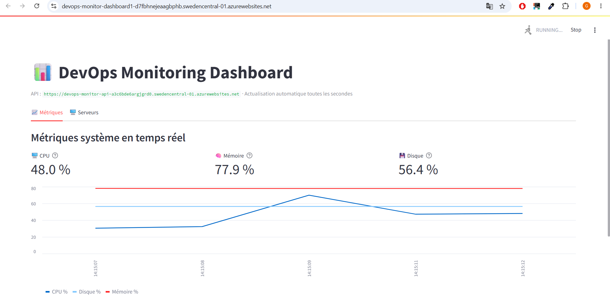
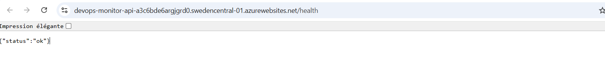

# DevOps Monitoring Dashboard

Ce dépôt contient une API FastAPI et un tableau de bord Streamlit pour le monitoring système.
Le projet est conçu pour être exécuté localement avec Docker Compose et déployé via GitHub Actions sur Microsoft Azure.

## Contenu du dépôt

```
devops-monitor/
├── api/                  # Backend FastAPI
├── dashboard/            # Frontend Streamlit
├── tests/                # Tests unitaires (pytest)
├── .github/workflows/    # CI/CD pipeline
├── docker-compose.yml
├── .env.example
├── Makefile
└── requirements.txt
```

## Vue d'ensemble

- L'API expose des endpoints pour la santé (`/health`), les métriques (`/metrics`), la gestion des serveurs et un WebSocket (`/ws/metrics`).
- Le dashboard consomme l'API et affiche les KPIs ainsi qu'un graphique temps réel.
- Localement les services sont démarrés via Docker Compose (deux conteneurs distincts : `api` et `dashboard`).

## Prérequis

- Python 3.11+ (pour exécuter les tests localement)
- Docker & Docker Compose
- Make (optionnel, facilite les commandes)
- (Optionnel) Azure CLI si vous déployez depuis la ligne de commande

## Lancer localement

1. Cloner le dépôt :

```bash
git clone https://github.com/<votre-username>/devops-monitor.git
cd devops-monitor
```

2. Créer le fichier d'environnement local et renseigner la clé API :

```bash
cp .env.example .env
# Éditer .env et définir API_KEY (valeur secrète)
```

3. Démarrer la stack :

```bash
make up
# ou : docker compose up --build
```

4. Accéder aux services depuis le navigateur :

- API : http://localhost:8000/docs
- Dashboard : http://localhost:8501

## Variables d'environnement importantes

- Pour le démarrage local, éditez `.env` (existant : `.env.example`). Les variables minimales :
	- `API_KEY` : clé secrète pour protéger les routes administratives
	- `API_BASE_URL` : URL de l'API utilisée par le dashboard (en Docker : `http://api:8000`)

- Pour un déploiement Azure Web App, ajouter les mêmes variables dans les Application Settings de chaque App Service :
	- `API_KEY` (même valeur pour API et Dashboard)
	- `API_BASE_URL` (URL publique de l'API, ex. `https://<nom-api>.azurewebsites.net`)
	- `WEBSITES_PORT` (8000 pour l'API, 8501 pour le dashboard si nécessaire)

## CI/CD et secrets GitHub

Le pipeline GitHub Actions inclus dans `.github/workflows/ci-cd.yml` attend certains secrets pour construire et déployer les images :

- `DOCKERHUB_USERNAME` : nom du compte Docker Hub
- `DOCKERHUB_TOKEN` : token d'accès pour Docker Hub
- `AZURE_WEBAPP_API_NAME` : nom de l'App Service API
- `AZURE_WEBAPP_API_PUBLISH_PROFILE` : publish profile XML pour l'API
- `AZURE_WEBAPP_DASHBOARD_NAME` : nom de l'App Service Dashboard
- `AZURE_WEBAPP_DASHBOARD_PUBLISH_PROFILE` : publish profile XML pour le dashboard

Si vous préférez un autre flux (ACR + Container Apps, service principal, etc.), le workflow devra être adapté.

## Tests

Exécuter les tests locaux :

```bash
make test
# ou : pytest tests/ -v --cov=api --cov-fail-under=75
```

## Remarques

- Ne committez jamais `.env` ni de secrets dans le dépôt.
- Le dépôt est organisé pour deux services séparés (API et Dashboard). Le déploiement par défaut du workflow publie deux Web Apps distinctes.

Pour toute modification de déploiement (par ex. pousser vers Azure Container Apps ou utiliser un registry privé), dites-moi ce que vous souhaitez et j'adapte la documentation et le workflow.

## Résultats

Les deux sont bien fonctionnels

Dashboard azure



Api azure



